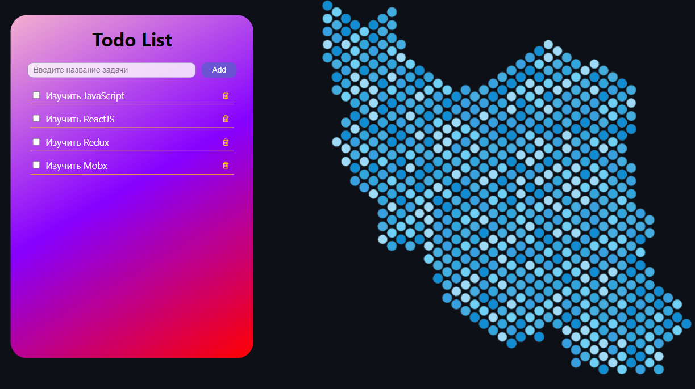

# Список задач



## Ссылки:

<a href="https://dmitriy9427.github.io/todo-list-react-redux-toolkit/" target='_blank'>Посмотреть можно здесь</a>

## Стэк:

- HTML5
- CSS3(module)
- React(фунциональные компоненты)
- react-redux
- Redux Toolkit

## Функциональность:

- Добавление задачи
- Удаление задачи
- Установка статуса выполнения

## Описание:

Этот проект был разработан для понимания, как работает библиотека redux-toolkit.

## Инструкция по установке:

Установите себе GIT - система контроля версий, перейдя по ссылке на офицальный сайт:

```
 https://git-scm.com/
```

После установки GIT, склонируйте репозиторий к себе на компьютер с помощью команды:

```
git clone https://github.com/dmitriy9427/todo-list-react-redux-toolkit.git
```

Далее установите редактор кода, я использую Visual Studio Code, скачать можно по ссылке указанной ниже.

```
https://code.visualstudio.com/
```

Установите Node.js

```
https://nodejs.org/ru
```

Запустите в редакторе кода склонированную папку, откройте терминал и запустите команду для установки всех необходимых зависимостей для проекта:

```
npm install
```

Когда все установлено, можно запускать проект локально с помощью команды:

```
npm start или npm run start
```
